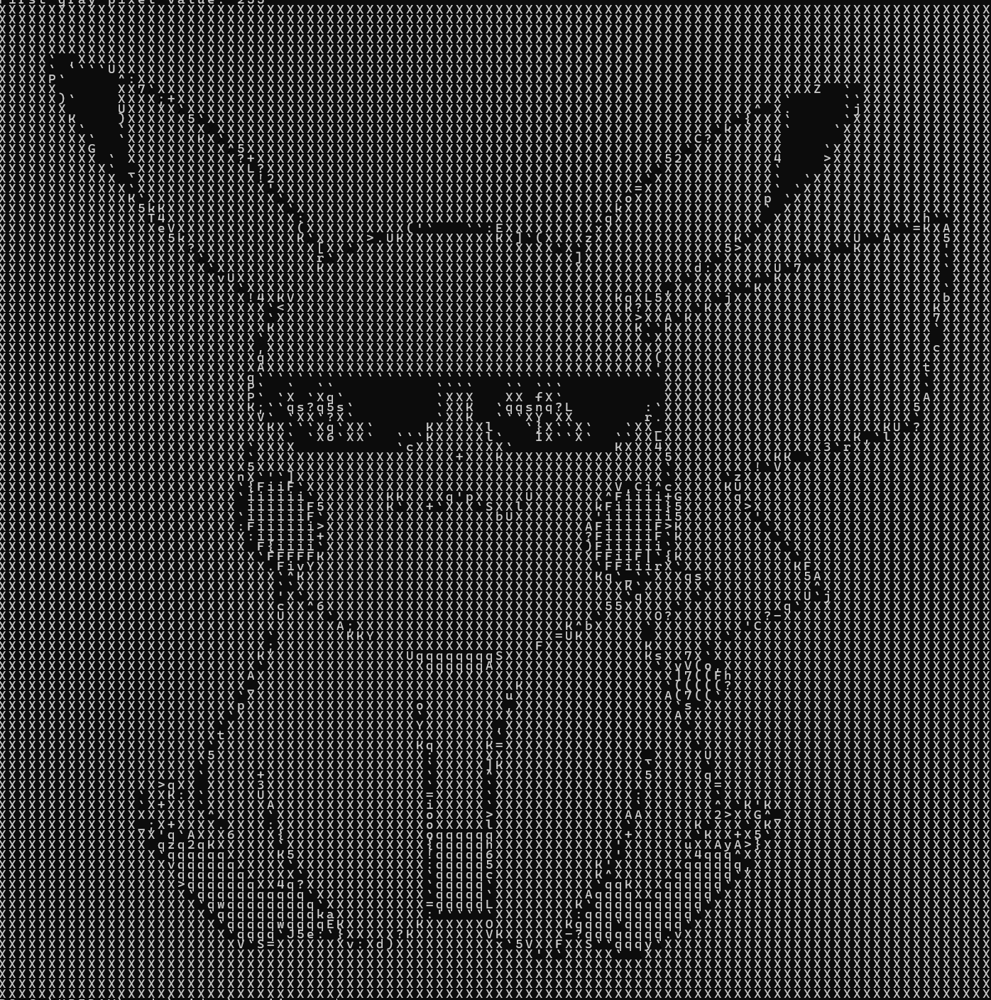
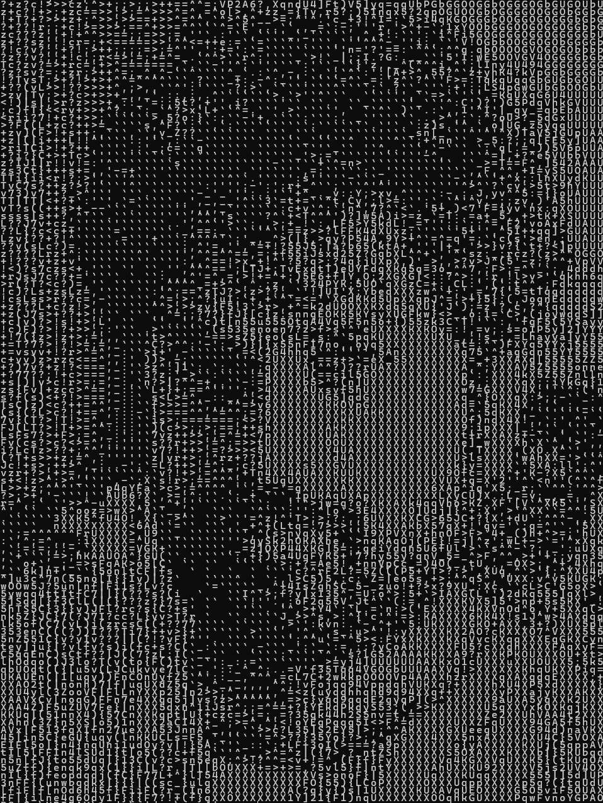

# AsciiGen

AsciiGen is a simple tool to generate ASCII art from images.

## Example Output

Output without compression:

## Caveats

- Terminal Line spacing could cause skewed output. Current code assumes a line spacing of 1:2. 
- Light mode is not supported yet
